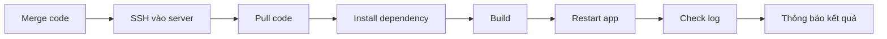
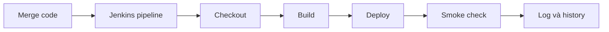

<style>
:root {
  --fg: #ece7df;
  --muted: #b9b0a3;
  --line: rgba(255, 231, 204, 0.12);
}

.slidev-layout {
  background:
    radial-gradient(circle at top left, rgba(232, 161, 95, 0.08), transparent 20%),
    linear-gradient(180deg, #101010 0%, #151515 100%);
  color: var(--fg);
  font-family: "IBM Plex Sans", sans-serif;
}

h1, h2, h3 {
  font-family: "IBM Plex Serif", serif;
  color: var(--fg);
  letter-spacing: -0.02em;
}

h1 {
  font-size: 2rem;
  line-height: 1.1;
  margin-bottom: 0.8rem;
}

h2 {
  font-size: 1.2rem;
  margin-top: 0.8rem;
}

p, li {
  font-size: 0.92rem;
  line-height: 1.55;
  color: var(--muted);
}

pre {
  font-size: 0.76rem !important;
  line-height: 1.33 !important;
}
</style>

# Seminar Jenkins Cơ Bản

Buổi này không nhằm dạy toàn bộ Jenkins. Mục tiêu là để mọi người nhìn rõ một câu hỏi rất thực tế: **sau khi merge code thì ai làm gì để môi trường chạy nhận bản mới?**

- Audience: dev, QA, DevOps mới làm quen Jenkins
- Mục tiêu: thấy rõ Jenkins đang tự động hóa phần việc nào trong flow build và deploy

---

# Bài toán sau khi merge code

Nếu hôm nay một task vừa merge xong, team sẽ làm gì để staging hoặc production nhận code mới?

- Pull code mới
- Cài hoặc cập nhật dependency
- Build ứng dụng
- Restart app hoặc service
- Kiểm tra log, xác nhận hệ thống chạy lại bình thường
- Thông báo kết quả cho team

Điểm quan trọng là đây không phải một bước đơn lẻ. Đây là một chuỗi thao tác kỹ thuật lặp đi lặp lại sau mỗi lần code thay đổi.

---

# Khi chưa có Jenkins

## Flow thủ công

- Merge code xong, một người phải vào server hoặc máy build
- Pull source mới về
- Cài package hoặc cập nhật môi trường nếu cần
- Chạy build
- Restart app
- Kiểm tra log và báo lại kết quả



Điểm đau là: phụ thuộc con người, dễ quên bước, khó biết fail ở đâu, và khó audit lại lịch sử release.

---

# Ví dụ thao tác tay trong một dự án Laravel

Nếu không có Jenkins, một lượt deploy có thể trông như sau:

```bash
ssh ubuntu@staging-server
cd /var/www/laravel-app
git pull origin dev
composer install --no-interaction --prefer-dist --optimize-autoloader
php artisan down
php artisan migrate --force
php artisan config:clear
php artisan cache:clear
php artisan route:clear
php artisan view:clear
php artisan config:cache
php artisan route:cache
php artisan view:cache
npm install
npm run build
php artisan queue:restart
sudo systemctl restart php8.2-fpm
sudo systemctl reload nginx
php artisan up
tail -n 50 storage/logs/laravel.log
curl -I https://staging.example.com

=> Nhìn vào chuỗi lệnh này sẽ thấy ngay: chỉ cần quên một bước hoặc chạy sai thứ tự là release có thể lỗi.
```


---

# Khi có Jenkins

## Flow tự động hóa

- Jenkins nhận trigger sau khi code thay đổi hoặc khi bấm build
- Checkout source
- Chạy build hoặc test theo rule đã định nghĩa
- Deploy lên môi trường demo hoặc staging
- Lưu lại log, trạng thái pass/fail, lịch sử build

## Ví dụ bước Jenkins chạy

```bash
git checkout dev
npm install
npm run build
pm2 restart jenkins-basic
curl -I http://staging-app
```



Ý chính ở đây là Jenkins không thay công việc nghiệp vụ. Jenkins thay phần việc kỹ thuật lặp đi lặp lại sau khi code thay đổi.

---

# Jenkins mang lại điều gì?

- **Nhanh hơn**: giảm thao tác tay sau mỗi lần merge hoặc release
- **Ổn định hơn**: cùng một pipeline chạy theo cùng một cách
- **Minh bạch hơn**: có console log, trạng thái pass/fail và lịch sử build
- **Dễ mở rộng hơn**: thêm test, notification, approval, nhiều môi trường

Nói ngắn gọn, Jenkins trước hết giải quyết bài toán lặp lại và dễ sai. Sau đó mới là nền tảng để mở rộng CI/CD nghiêm túc hơn.

---

# Demo flow trong buổi seminar

1. Mở app đang chạy
2. Sửa một text rất nhỏ
3. Push code
4. Trigger Jenkins
5. Xem console log
6. Refresh app để thấy thay đổi

## Ví dụ thay đổi

- Before: `Team Task Board`
- After: `Team Task Board - Updated`

Mục tiêu của demo không phải chứng minh Jenkins có mọi tính năng. Mục tiêu chỉ là để team thấy pipeline đang thay con người xử lý phần việc lặp lại.

---

# Demo đang tối giản hạ tầng, không tối giản quy trình

## Trong lab hiện tại

- Jenkins và app có thể đang cùng một EC2
- Dễ dựng hơn, ít rủi ro hơn
- Phù hợp cho seminar nội bộ

## Trong dự án thực

- Jenkins server build
- App server nhận bản deploy
- Có thể thêm staging, production, approval

Thông điệp không thay đổi: **Jenkins nhận code, build, deploy, verify**. Chỉ khác ở chỗ hạ tầng demo đang được rút gọn để buổi seminar chắc thắng hơn.

---

# Sau mức cơ bản, Jenkins có thể làm thêm gì?

- Tự chạy test trước khi deploy
- Gửi Slack hoặc email khi build fail
- Tự deploy staging sau merge
- Yêu cầu approval trước production
- Chuẩn hóa release cho nhiều service

---

# Kết luận

## Không có Jenkins: thao tác tay

## Có Jenkins: workflow tự động

Jenkins biến chuỗi bước kỹ thuật sau khi merge code thành một quy trình có log, có lịch sử, và dễ lặp lại hơn.

## Q&A

